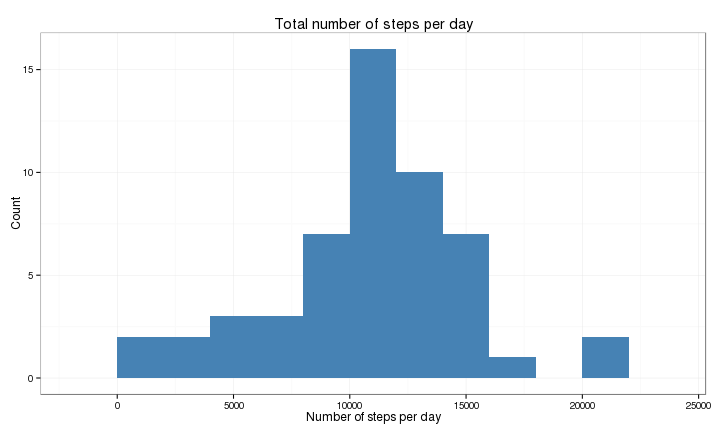
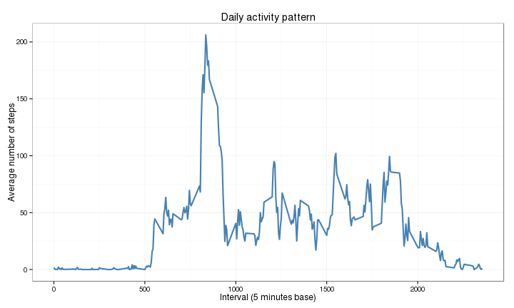
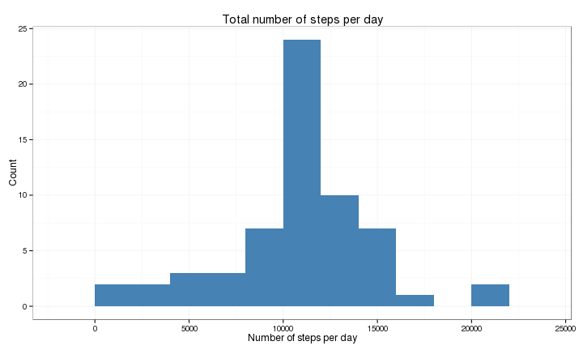
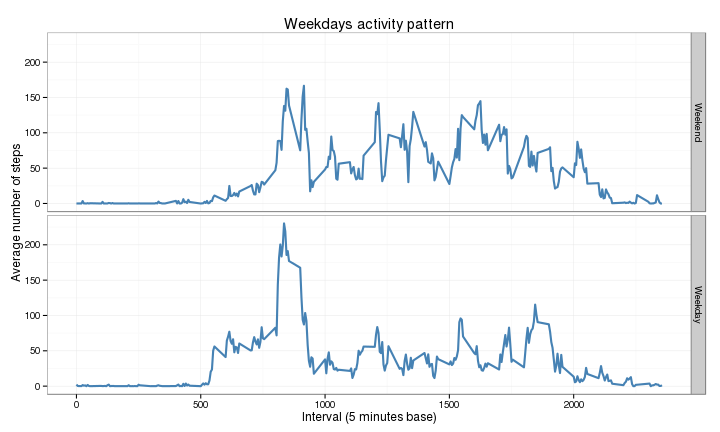

# Reproducible Research: Peer Assessment 1
**Author:** Alexander Gedranovich  
**Date:** 2014-05-18

## Loading and preprocessing the data
First of all we load libraries needed for data transformation and analysis:

```r
library(dplyr)  # Data transformation
library(lubridate)  # Dates manipulation
library(ggplot2)  # Plotting
```


Then we read the data and demonstrate its' content:

```r
df <- read.table("data/activity.csv", sep = ",", header = T)
head(df)
```

```
##   steps       date interval
## 1    NA 2012-10-01        0
## 2    NA 2012-10-01        5
## 3    NA 2012-10-01       10
## 4    NA 2012-10-01       15
## 5    NA 2012-10-01       20
## 6    NA 2012-10-01       25
```


## What is mean total number of steps taken per day?

Before making the histogram, let's construct new data.frame with average number of steps for each day. Note, we omit NA values here.

```r
df.total <- df %.%
  group_by(date) %.%
  summarise(total = sum(steps)) %.%
  filter(!is.na(total))
head(df.total)
```

```
## Source: local data frame [6 x 2]
## 
##         date total
## 1 2012-10-02   126
## 2 2012-10-03 11352
## 3 2012-10-04 12116
## 4 2012-10-05 13294
## 5 2012-10-06 15420
## 6 2012-10-07 11015
```


### Histogram of the total number of steps taken each day

```r
ggplot(df.total) + 
  geom_histogram(aes(x = total), binwidth = 2000, fill = "steelblue") +
  theme_bw() + xlab("Number of steps per day") + ylab("Count") + 
  ggtitle("Total number of steps per day")
```




### Mean and median total number of steps taken per day

```r
df.total %.%
  summarise(
    mean = mean(total),
    median = median(total)
    )
```

```
## Source: local data frame [1 x 2]
## 
##    mean median
## 1 10766  10765
```


## What is the average daily activity pattern?
New data.frame with average steps per 5 minutes interval:

```r
df.daily <- df %.%
  group_by(interval) %.%
  summarise(mean = mean(steps, na.rm = T))
head(df.daily)
```

```
## Source: local data frame [6 x 2]
## 
##   interval    mean
## 1        0 1.71698
## 2        5 0.33962
## 3       10 0.13208
## 4       15 0.15094
## 5       20 0.07547
## 6       25 2.09434
```


### Time series plot of the 5-minute interval and the average number of steps taken, averaged across all days

```r
ggplot(df.daily) + 
  geom_line(aes(x = interval, y = mean), colour = "steelblue", size = 1) + 
  theme_bw() + 
  xlab("Interval (5 minutes base)") + ylab("Average number of steps") + 
  ggtitle("Daily activity pattern")
```




### Which 5-minute interval, on average across all the days in the dataset, contains the maximum number of steps?

```r
df.daily[which.max(df.daily$mean), ]
```

```
## Source: local data frame [1 x 2]
## 
##     interval  mean
## 104      835 206.2
```

Most steps are done at 835 interval. Most probably, while going to the work or jogging.

## Imputing missing values

```r
df.missing <- df %.%
  filter(is.na(steps)) %.%
  group_by(date) %.%
  summarise(missing = n())
df.missing
```

```
## Source: local data frame [8 x 2]
## 
##         date missing
## 1 2012-10-01     288
## 2 2012-10-08     288
## 3 2012-11-01     288
## 4 2012-11-04     288
## 5 2012-11-09     288
## 6 2012-11-10     288
## 7 2012-11-14     288
## 8 2012-11-30     288
```

```r
sum(df.missing$missing)
```

```
## [1] 2304
```

As we can see all missing values are associated with 8 days. Moreover all 5-minutes intervals are missing for these days. Total number of missing values are 2304.

Imputing strategy will be very simple -- we replace missing values with the rounded mean for that 5-minute interval.

```r
Impute <- function(int) {
  # Returns rounded average value for given 5-minutes interval
  # 
  # Args:
  #   int: 5-minutes interval
  
  round(df.daily[df.daily$interval %in% int, ]$mean)
}

replace.intervals <- (df %.%
  filter(date %in% df.missing$date) %.%
  select(interval))[, 1]

df$steps[df$date %in% df.missing$date] <- Impute(replace.intervals)
```


Making new data.frame and histogram for data with imputed values:

```r
df.total <- df %.%
  group_by(date) %.%
  summarise(total = sum(steps)) %.%
  filter(!is.na(total))
```


New histogram (with imputed values) is very similar:

```r
ggplot(df.total) + 
  geom_histogram(aes(x = total), binwidth = 2000, fill = "steelblue") +
  theme_bw() + xlab("Number of steps per day") + ylab("Count") + 
  ggtitle("Total number of steps per day")
```




Also we can observe no change in mean and little shift in median value.

```r
df.total %.%
  summarise(
    mean = mean(total),
    median = median(total)
    )
```

```
## Source: local data frame [1 x 2]
## 
##    mean median
## 1 10766  10762
```


## Are there differences in activity patterns between weekdays and weekends?

Firstly we create new factor for week days:

```r
WeekDay <- function(x) {
  # Determines whether the given day is weekend or not
  #
  # Args:
  #   x: vector of dates in YYYY-MM-DD format
  #
  # Returns:
  #   "Weekend" or "Weekday" as factor variable
  
  x <- weekdays(ymd(x)) %in% c("Saturday", "Sunday")
  factor(x, levels=c(T, F), labels=c("Weekend", "Weekday"))
}

df.week <- df %.%
  mutate(weekday = WeekDay(date)) %.%
  group_by(interval, weekday) %.%
  summarise(mean = mean(steps, na.rm = T))

head(df.week)
```

```
## Source: local data frame [6 x 3]
## Groups: interval
## 
##   interval weekday   mean
## 1        0 Weekend 0.2500
## 2        0 Weekday 2.2889
## 3        5 Weekend 0.0000
## 4        5 Weekday 0.4000
## 5       10 Weekend 0.0000
## 6       10 Weekday 0.1556
```


To make panel plot we utilize facetting from *ggplot* package:

```r
ggplot(df.week) + 
  geom_line(aes(x = interval, y = mean), colour = "steelblue", size = 1) +
  facet_grid(weekday ~ .) +
  theme_bw() + 
  xlab("Interval (5 minutes base)") + ylab("Average number of steps") + 
  ggtitle("Weekdays activity pattern")
```




The plot implies that there are some differences in stepping pattern for weekend and weekdays:  
1. Less steps in the morning for weekend  
2. More steps at midday for weekend  
